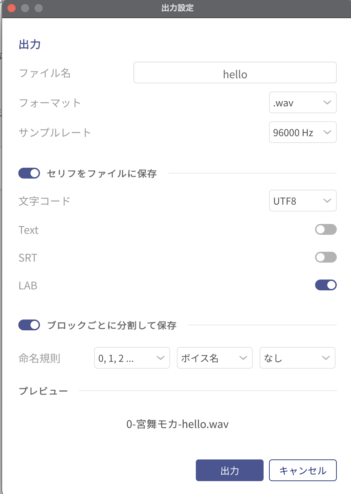

# VoicePeak 宮舞もか 感情別口パク・まばたき グリーンバック素材自動生成ツール

このツールは、VoicePeakで作成した宮舞もかの音声に合わせて、感情表現の立ち絵を使用した口パクと瞬きのグリーンバック動画素材を自動生成します。  
感情豊かなリップシンク動画素材を手軽に作成できますので、ぜひお試しください！  
  
キャラクターの立ち絵は、[AH-Softの公式サイト](https://www.ah-soft.com/moca/)内でおまけとして紹介されている表情差分イラストを使用させていただいています。    
  
表情差分イラストのみほしい場合は、以下のZIPファイルからダウンロード可能です
[https://www.ah-soft.com/moca/moca_illust.zip](https://www.ah-soft.com/moca/moca_illust.zip)

---

## 動画作成までの流れ

### 1. プログラムのクローンと移動
  
まずは、このプログラムをGitHubからあなたのパソコンにダウンロードします。  

```sh
git clone https://github.com/crum7/Miyamai_Moka_Lip_Sync_Emotion.git
```
  
```sh
cd Miyamai_Moka_Lip_Sync_Emotion
```
  
2. 立ち絵ファイルのダウンロードと感情別分類  
  
次に、立ち絵の画像ファイルを自動でダウンロードし、感情ごとに分類します。  
```sh
chmod 777 classify_images.sh
```
  
```sh
./classify_images.sh
```
  
3. VoicePeakでのプロジェクト作成
	1.	文章入力
      VoicePeakで、読み上げさせたい文章を入力してください。
	2.	プロジェクトの保存
      画面上部左側のバナーにある「…」から「名前をつけてプロジェクトを保存」を選択します。
	3.	保存先の設定
      プロジェクト保存時に、新規フォルダを作成します。
      重要： 作成するフォルダの名前は、プロジェクトファイル名（.vpp）と同じにしてください。
例:
	•	新規フォルダ名：Test
	•	プロジェクトファイル名：Test.vpp

4. VoicePeakでの音声の書き出し
- 画面上部左側のバナーにある「…」から「出力」を選択します。

出力設定
- ファイル名 : プロジェクトファイル名と同じ
- フォーマット : .wav
- サンプルレート : 96000Hz
- セリフをファイルに保存 : オン
   - 文字コード :  UTF-8
   - LAB : オン
- ブロックごとに分割して保存 : オン
   - 命名規則左から : 「0,1,2...」「ボイス名」「なし」
- プレビュー
   - 0-宮舞モカ-プロジェクト名.wav」だったらOK

画像



保存したプロジェクトフォルダ内に、以下のファイルが存在していることを確認してください。
   - プロジェクトファイル（JSON形式の .vpp）
	-	音声ファイル（.wav）
	-	口パクタイミング情報の .lab ファイル

このような形になっていれば大丈夫！
例: プロジェクト名を"hello"にした場合
```sh
.
├── Lip_Sync_Movie
├── Moca_illust_divide
├── classify_images.sh
├── generate_lip_sync_with_lab_file.py
├── hash_list.txt
└── hello
    ├── 0-宮舞モカ-hello.lab
    ├── 0-宮舞モカ-hello.wav
    ├── 1-宮舞モカ-hello.lab
    ├── 1-宮舞モカ-hello.wav
    ├── 2-宮舞モカ-hello.lab
    ├── 2-宮舞モカ-hello.wav
    ├── 3-宮舞モカ-hello.lab
    ├── 3-宮舞モカ-hello.wav
    ├── 4-宮舞モカ-hello.lab
    ├── 4-宮舞モカ-hello.wav
    ├── hello.lab
    └── hello.vpp
```

5. 口パク・感情別立ち絵の動画の作成
```sh
python generate_lip_sync_with_audio.py
```

6. 動画の確認

動画は、以下の形式で出力されます。  
- 保存先：Lip_Sync_Movie/<プロジェクトフォルダ名>/  
- ファイル形式：output_block_<ブロック番号>.mp4  

生成された動画を再生して、口パクとまばたきの動作を確認してください。

---

補足  
	- 必要な環境:  
	- Python 3.10.9(他の環境でのテストはできていません。)  
	- Bashシェル（Linux、macOS、またはWindowsのWSL/Git Bashなど）  
	- VoicePeak（音声合成ソフト）  


